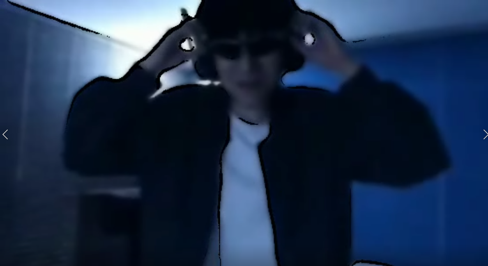
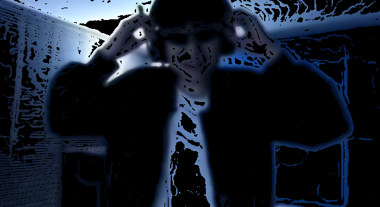
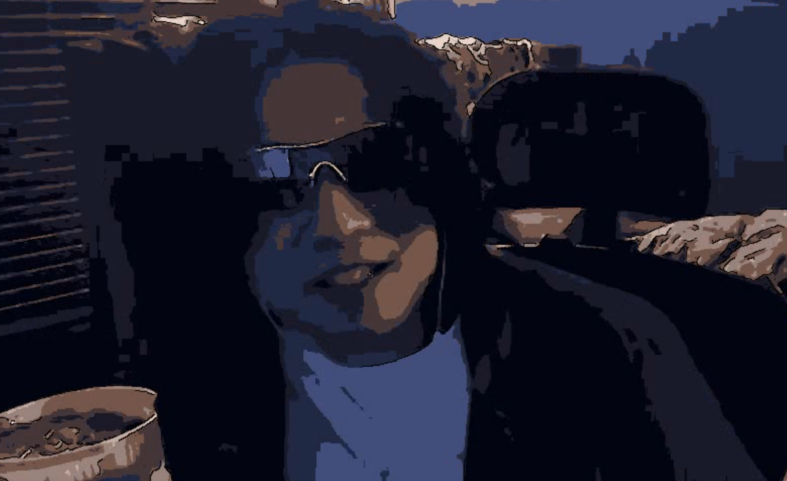
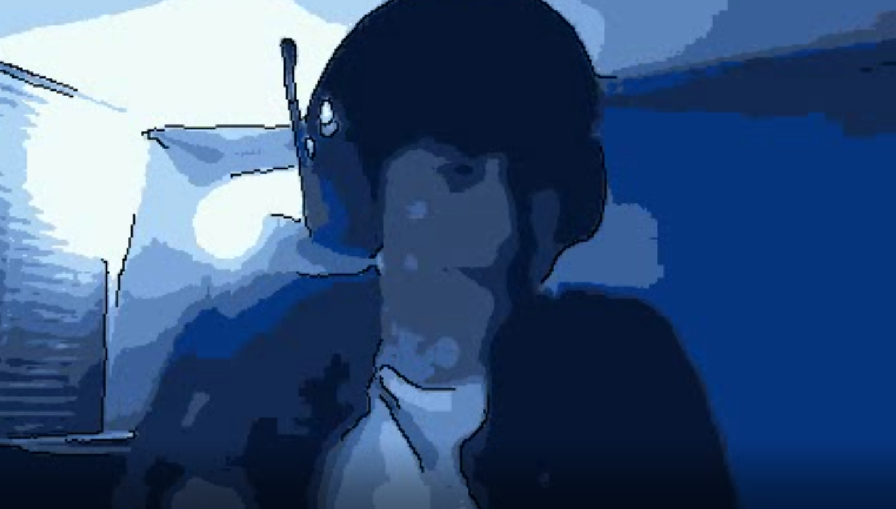

# photooner

photo to cartoon changer

#제작과정

처음엔 과제의 예시코드인 사진을 카툰처럼 바꿔주는 코드를 이용해 영상을 변환하는 코드(=basic_converter.py)를 만들었지만 매우 흐릿하고 엣지 자체도 뜨문뜨문 찍혀있음. 그래도 전체적으로 영상이 부드러워지고 특정부분엔 원하는데로 굵은 선이 포착됌.

Smoothing이 문제인가 싶었지만 원하는 필터인 미디안 필터가 적절히 들어가있는걸 확인하고 Sobel magnitude로 엣지를 검출함.(sobel_test.py)
하지만 예상외로 엣지가 매우 기괴하게 나왔다.

그래서 전지전능한 chat gpt한테 어떻게 하면 조금 더 만화같이 변환을 할 수 있는지 물어보았고 해결책으로 sobel 대신 canny로 엣지를 검출하고 엣지를 강조하고 컬러 양자화로 이미지의 색상 범위를 줄이면 더 만화같이 변환할 수 있다는 해결책을 제시함.

잘 변환된 영상인 sunglasses.avi의 스크린샷

잘 변환되지 않은 영상인 no-sunglasses.avi의 스크린샷

확실이 엣지와 노이즈같은 부분들이 많이 개선된 모습을 보임 하지만 위의 첫번째 사진은 정적인 움직임과 강하지 않은 빛, 그리고 중점적으로 표현해야하는 부분들(e.g.눈, 선글라스)이 상대적으로 큼지막하고 전체적으로 색깔이 적당히 다채로워서 꽤나 카툰의 느낌, 픽셀 아트의 느낌이 있는 영상을 생성해내는 반면

두번째 사진은 동적인 움직임을 보이며 특정부분의 매우 밝은 빛. 그리고 상대적으로 저화질의 영상이어서 카툰 느낌으로 표현하기보단 영상 자체를 뭉개버리는 듯한 영상을 생성해냄.

위와같이 2번째 사진에 대한 알고리즘의 문제가 있지만 공통적으로 나오는 문제도 있는데 화면이 수시로 의도하지않은 번쩍임같은 효과가 일어난다. 아마도 영상이 흘러감에 따라 컬러 양자화로 선택된 컬러가 장면에서 다른 장면으로 넘어갈때 꽤나 크게 변환되어 수시로 특정부위의 컬러가 실제 영상에서는 크게 변화하지 않았지만 변환된 영상에서는 색상차이가 크게 뛰어버리는 것으로 추측된다.
